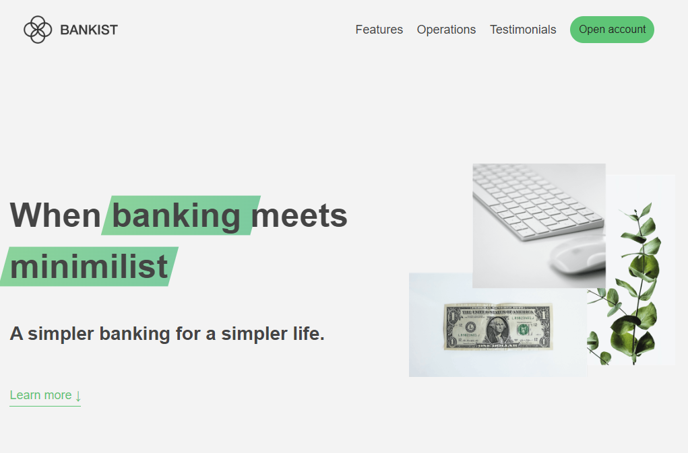
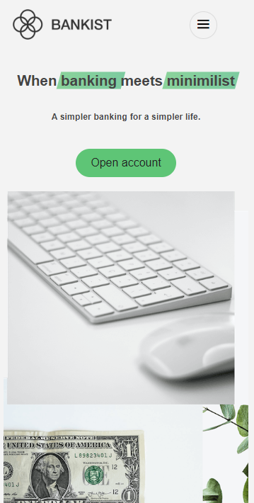

# TABLE OF CONTENTS

[Project Title](#project-title)
[Description](#description)
[Installation](#installation)
[Usage](#usage)
[Guidelines](#guidelines)
[Testing the Application](#testing-the-application)
[Github](#github)
[Contact Us](#contact-us)
[Licence](#licence)

## Project Title

The Bankist Website

## Description

The Bankist website was developed to learn Javascript as part of Jonas Scmedtmanns course: The complete javascript course 2024: from zero to expert. [Udemy link](https://www.udemy.com/course/the-complete-javascript-course/?couponCode=LEADERSALE24B)

The course contained a template for the website but I chose to create a complete bare bones project setup using webpack version 5 and utilising Andy Bells & Hayden Pickerings Cube CSS methodology to organise the SCSS code. [Cube CSS Website](https://cube.fyi/#what-does-cube-css-stand-for)

This project uses CSS Grid and Flexbox with media queries to make it responsive. A wireframe using Figma was used to recreate the layout for both the desktop and mobile versions.

## Github

https://github.com/Sho-ayb

## Deployed Live

[The Bankist Website](https://sho-ayb.github.io/the-bankist-website-jonas/)

## Images of website

## Questions

Sho.ayb@outlook.com

## Licence

MIT License

Please click on the badge for more details on the licence.

